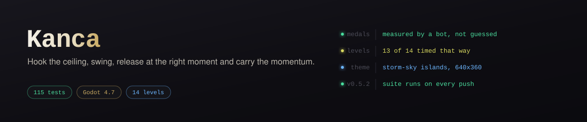
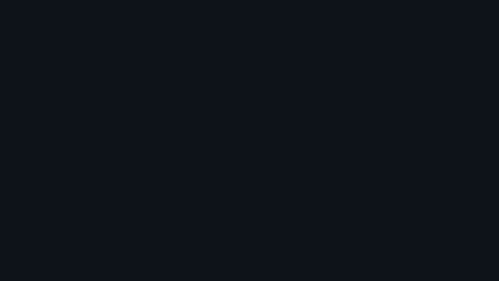

# Kanca

<p align="center"></p>
<p align="center"><sub><a href="docs/reel/reel.mp4">Sesli MP4 sürümü</a></sub></p>
<h3 align="center"><a href="https://furkiozknn.github.io/kanca/">Tarayıcıda oyna → furkiozknn.github.io/kanca</a></h3>

*Throw a hook at the ceiling, swing, release at the right moment and carry the momentum. A speed-focused 2D swinging platformer (Godot 4, Turkish and English UI, flat-colour look matching the trailer); medal times come from real bot runs rather than formulas — 13 of 14 levels measured. 216 tests.*

[](https://github.com/Furkiozknn/kanca/actions/workflows/ci.yml)

**Kancanı tavana at, sarkaç gibi salın, tam zamanında bırak ve momentumla fırla —
bölümü en kısa sürede bitir.**

Hız odaklı 2B sallanma platform oyunu. Godot 4.7.2, GL Compatibility,
640×360 taban çözünürlük. Görünüm: **tanıtım videosundaki dünya** — düz renk,
gölgesiz; lacivert (bölüm 1–7) ve kâğıt (8–14) tema, turkuaz oyuncu, turuncu
vurgu, kırmızı diken. Arayüz **Türkçe ve İngilizce**.


Durum: **arayüz yenilemesi** (son yayın v0.5.2) — her push'ta ve her PR'da
**216 testin** koştuğu CI. Çekirdek mekanik, bölümler ve bot eşikleri v0.5 ile
aynı; yenilenen şey görünüm, arayüz, dil ve girdi tepkisi. Denetim ve tasarım
kararları: [`docs/DENETIM.md`](docs/DENETIM.md), [`docs/TASARIM.md`](docs/TASARIM.md).

**Oyunda ne var:** 14 bölüm, düz renkli vektör dünya (PNG yok), ses ve müzik,
Türkçe/İngilizce arayüz, ayarlar ekranı, madalyalar, hayalet tekrarı (kendi koşun ya da **altın hayalet**), kontrol noktaları,
günlük meydan okuma, puanlamalı hedefleme, kancada tampon + kojot, halat pompası,
bırakma bonusu, ileri bakan kamera, tek parmak dokunmatik şeması, tuş atama, rota
ipucu ve ustalık zinciri.

**Madalya eşikleri 14 bölümün 13'ünde ölçülmüş bot koşusundan geliyor** — formülle
değil. Kalan biri hâlâ tahmin ve "Bilinen sınırlar" bölümünde öyle yazıyor.

Sürüm sürüm ne değiştiği: **[SURUM-GECMISI.md](SURUM-GECMISI.md)** · güncel sürümün
notları [Releases](https://github.com/Furkiozknn/kanca/releases) sayfasında.


## Hızlı başlangıç

**Amaç:** her bölümde bayrağa en kısa sürede ulaşmak. Çukura, dikene değersen
ölürsün (kontrol noktasından devam, ama sayaç durmaz). Süren altın / gümüş /
bronz eşiğiyle karşılaştırılır; ilk bölümün altını **3,456 sn**.

**Platform:** Windows ve Web (tarayıcı). Klavye + fare, gamepad ya da
dokunmatik (tek parmak). Arayüz Türkçe ve İngilizce: varsayılan dil işletim
sistemi / tarayıcı dili (Türkçeyse Türkçe, değilse İngilizce), menüden ve
Ayarlar'dan değiştirilir.

**Oynamanın üç yolu:**

1. **Tarayıcıda:** **[furkiozknn.github.io/kanca](https://furkiozknn.github.io/kanca/)** —
   kurulum gerekmez. 29 Eylül 2026'da yerel web dışa aktarması masaüstü
   Chromium'da açıldı: menü geldi, **Oyna** 1. bölümü yükledi, klavyeyle
   koşuldu, duraklat ve dil değişimi çalıştı, konsolda hata yok (yalnız WebGL
   `Attachment has zero size` uyarıları). Yalnız pencere boyutu emülasyonuyla
   (375×812 dikey, 812×375 yatay) bakıldı; gerçek dokunmatik ve mobil tarayıcı
   denenmedi.
2. **Hazır paket (Godot gerekmez):** [Releases](https://github.com/Furkiozknn/kanca/releases)
   sayfasında yayımlanan her sürüme Windows ve Web zip'i **Yapi** iş akışıyla
   otomatik eklenir. Bu, v0.5.2'den *sonraki* sürümlerden itibaren geçerli;
   v0.5.2 sayfasında paket yok. O zamana kadar paketler
   [Yapi koşusunun](https://github.com/Furkiozknn/kanca/actions/workflows/yapi.yml)
   *Artifacts* bölümünde duruyor (GitHub'a giriş gerekir; Windows için
   `kanca.exe`'yi çalıştır, web paketini aşağıdaki gibi yerel bir sunucuyla aç).
3. **Kaynaktan, Godot 4.7.2 ile:** görseller ve sesler **Git LFS**'te.
   LFS'siz klonda oyun açılmaz (bkz. [Sorun giderme](#sorun-giderme)).

   ```bash
   git lfs install
   git clone https://github.com/Furkiozknn/kanca
   cd kanca
   godot --headless --path . --import   # ilk kez: varlıkları içe aktar
   godot --path .                       # oyunu aç (ana sahne: menü)
   ```

   `godot` burada Godot 4.7.2-stable çalıştırılabiliri
   ([indir](https://github.com/godotengine/godot/releases/tag/4.7.2-stable)).
   CI de bu sürümü kullanıyor; başka sürüm denenmedi.

Web paketini yerelde açmak için klasörü bir HTTP sunucusuyla sun
(`file://` ile açılmaz): `python3 -m http.server -d build/web 8000`, sonra
<http://localhost:8000>.

## Kontroller

| İş | Klavye / Fare | Gamepad |
|---|---|---|
| Koş / salınımı büyüt | `A` `D` veya `←` `→` | Sol çubuk, D-pad |
| Zıpla (kancalıyken: kopar + fırla) | `Boşluk` | `A` |
| Nişan al | Fare | Sağ çubuk |
| Kancayı at (basılı tut) / bırak | `Sol tık` | `RB` |
| Halatı kısalt / uzat | `W` `S` veya `↑` `↓` | D-pad yukarı/aşağı |
| Bölümü yeniden başla | `R` | `X` |
| Duraklat | `Esc` | `Start` |

Klavye atamaları **Ayarlar → Tuş atama** ekranından değiştirilir; fare ve gamepad
atamaları olduğu gibi kalır. Dokunmatikte tuş atama ekranı hiç kurulmaz ve
düğmelerdeki tuş ekleri düşer ("Geri  (Esc)" → "Geri"): tek eylemli düğmeler
`Ayarlar.kisayol()` üzerinden, iki şemaya göre baştan farklı yazılan metinler
(menü yardımı, HUD şeridi, tuş atama satırı) `Ayarlar.dokunmatik_mi()` dalıyla
geçer; garantiyi bütün ekranları tarayan test veriyor.

Nişan yoksa (fare hareketsiz, çubuk boşta) kanca, bakış yönündeki en uygun
noktaya gider. Seçili aday nokta **turuncuya döner** ve araya **kesik çizgi**
çekilir, bağlı olan büyür, **menzil dışındakiler soluklaşır**.

### Tek parmak şeması (mobil)

Mobilde otomatik açılır, masaüstünde **Ayarlar → Tek parmak şeması** ile denenir.

| Hareket | Sonuç |
|---|---|
| Koşu | Otomatik (ileri). Sallanırken pompalama da otomatik. |
| Dokun | Hedef varsa kanca atılır, yoksa yerdeyken zıplanır. |
| Parmağı kaldır | Halat bırakılır (fırlama bonusu geçerli). |
| Basılıyken dikey kaydır | Halatı kısaltır / uzatır. |

Nişan, parmağın ekranda bulunduğu noktaya bakar.

## Oynanış

- **Hedefleme puanlanır.** Menzildeki her kanca noktası için
  `puan = nişan hizası × 3 − uzaklık / menzil + hız yönüne uyum`; arada katı zemin
  varsa (ışın testi) nokta aday sayılmaz. Yani hızla sağa uçarken sağdaki nokta,
  aynı hizadaki soldakini yener — kritik anda kanca boşa gitmez.
  Nişan yardımının genişliği **Ayarlar → Nişan** kaydıracıyla ayarlanır
  (sol uç: geniş yardım, sağ uç: tam nişan).
- **Tampon + kojot-kanca.** Basış 0,12 sn saklanır: o sırada hedef belirirse
  kanca yine de takılır. Hedef menzilden yeni çıktıysa 0,12 sn daha tutulabilir.
- **Halat pompası.** Gergin halatı kısaltmak açı momentumunu korur — yayın
  dibinde kısaltmak hız kazandırır (Worms ninja halatı ustalığı).
  `POMPA_VERIMI` ile yumuşatılmıştır, hız tavanı yine `AZAMI_HIZ`.
- **Bırakma bonusu.** `BIRAKMA_ESIGI` (380 px/sn) üstünde bırakırsan
  `BIRAKMA_CARPANI` (×1,10) + altın parçacık + `firla` sesi; altında hıza
  hiç dokunulmaz. Doğru anda bırakmak artık duyuluyor ve görülüyor.
- **İleri bakan kamera.** Kamera hız yönüne kayar (en çok 84 px) ve yüksek hızda
  görüntü %9'a kadar genişler — nereye uçtuğun önceden görünür.
- **Ustalık zinciri ("Akış").** Yere değmeden art arda taktığın her kanca zinciri
  uzatır; sol üstte `AKIŞ ×N` görünür, bölüm sonunda en uzun zincir süreden ayrı
  not olarak yazılır ve kaydedilir.
- **Rota ipucu.** Bir bölümde altın madalya kazandıktan sonra, bot rotasının
  kullandığı kanca noktaları altın tonda işaretlenir. Ayarlardan kapatılabilir.
- **Kanca anında takılmaz.** Sol tıkta halat uçmaya başlar, `KANCA_UCUS_SURESI`
  (55 ms ≈ 3 kare) sonra tutunur; tutunma anında küçük sarsıntı + ses var.
  Atışın bir ağırlığı olsun diye gerçek bir gecikme, ama tepkiyi bozmayacak kadar kısa.
- **Momentum senden geri alınmaz.** Bırakınca hıza dokunulmaz (yalnız küçük bir
  `BIRAKMA_CARPANI` bonusu). Hızlıyken arkanda hız izi çizilir.
- **Ölüm** = çukur, diken veya tavan dikeni. Kontrol noktası varsa oradan devam
  edersin ama **sayaç durmaz** — ölmek yine de süre kaybıdır.
- **Madalya:** her bölümün altın/gümüş/bronz hedef süresi var (ms hassasiyetinde,
  bot koşusundan üretilmiş — aşağıya bak); oyun içinde sol üstte altın hedefi,
  bitişte kazanılan madalya, Bölüm Seç ekranında bölüm başına madalya rozeti görünür.
- **Hayalet:** bir bölümü yeni rekorla bitirdiğinde koşun kaydedilir ve sonraki
  denemede yarı saydam hayalet olarak yanında oynar. Ayarlarda üç seçenek var:
  *Kapalı*, *En iyi koşun*, **Altın hayalet** — sonuncusu botun koşusunu altın
  renkli oynatır ve yalnız o bölümde **altın madalya kazandıktan sonra** açılır.
  Kayıt 10 Hz örnek + ara değer (bölüm başına birkaç yüz bayt).
- **Günlük meydan okuma:** tarihten tohumlanan bir bölüm + küçük bir değiştirici
  (kısa halat ya da yan rüzgâr). Herkeste aynı, günde bir değişir. Kendi kayıt
  yuvası var: ana ilerlemeyi, en iyi süreleri ve hayaletleri bozmaz.

### Akış zinciri

Yere değmeden art arda tutulan her nokta zinciri uzatır; HUD'da "Akış ×N"
olarak görünür (ikiden itibaren). Bölüm başına en uzun zincir kaydedilir
(`Kayit.akis`), bitiş kartında "YENİ EN UZUN ZİNCİR" diye anılır ve
**Bölüm Seç** ekranında her düğmenin sağ altında turuncu "×N" rozeti olarak
durur. Süreden ayrı bir not: en hızlı koşu her zaman en şık koşu değil.

### Bölüm öğeleri

| Öğe | Görünüm | Davranış |
|---|---|---|
| Sabit kanca noktası | dolu disk (blok rengi) | Yerinde durur. |
| Hareketli kanca noktası | disk + turuncu halka | İki uç arasında gidip gelir; halat çapası da hareket eder. |
| Kırılgan kanca noktası | kesik halka | Bir kez tutulur; bıraktığın an yanıp söner ve kırılır. |
| Rüzgâr / itici alan | soluk perde + akan çizgiler | İçindeyken sürekli ivme uygular. Halatı bırakıp akıntıya girmek en hızlı yol. |
| Diken / tavan dikeni | kırmızı üçgenler | Değince ölüm. Tavan dikenleri halatı kısa tutmayı zorunlu kılar. |
| Kontrol noktası | ince direk + flama (turkuazken aktif) | Ölünce buradan devam; süre durmaz. |
| Bitiş | yüksek direk + turuncu bayrak | Değince bölüm biter. |

## Bölümler

| # | Ad | Tanıttığı / kısayolu |
|---|---|---|
| 1 | İlk Tutuş | Öğretici: nişan al, tut, bırak. Üstteki yüksek nokta tek salınışta boşluğu geçirir. |
| 2 | Halat Boyu | Öğretici: halatı kısalt/uzat. Kısaltıp savurursan orta platforma hiç inmezsin. |
| 3 | Diken Tarlası | Diken = ölüm. Tek uzun salınımla tarlanın tamamı atlanır. |
| 4 | Uçurum | Üst hat zincirinde iki uçurum birden geçilir. |
| 5 | Yukarı | Yükselen platformlar; üst kanca hattı platformlara hiç değmeden taşır. |
| 6 | Sallanan Kayalar | **Hareketli nokta.** Nokta sana doğru gelirken tutarsan salınım bedava büyür. |
| 7 | Dar Geçit | Alçak tavan; halatı asgariye indirip tam tur atmak çıkışta yüksek hız verir. |
| 8 | Tek Kullanımlık | **Kırılgan nokta.** Duraklama; zinciri baştan planla. Alttaki sabit hat da çalışır ama yavaştır. |
| 9 | Rüzgâr | **İtici alan.** İlk akıntıya yatay girersen kanca atmadan karşıya taşınırsın. |
| 10 | Dikenli Tavan | **Tavan dikeni.** Halatı 28 px'e indirip alçaktan geçmek en hızlı yol. |
| 11 | Hız | Düz zeminli en uzun bölüm, **iki kontrol noktalı**. y=64 sırası hiç yere inmeden bitişe gider. |
| 12 | Kırık Sarkaç | Hareketli + kırılgan bir arada, bir kontrol noktası. |
| 13 | Fırtına | Rüzgâr + tavan dikeni, iki kontrol noktası. Akıntıya alçaktan gir, halatı uzatma. |
| 14 | Final | Hepsinin karışımı, iki kontrol noktası. |

## Nasıl çalıştırılır

### Godot kurmadan bir paket indir

Depoda **Yapi** adında bir iş akışı var; sabit Godot 4.7.2-stable ile
Windows ve Web paketlerini üretir. İki yoldan çalışır:

- **Elle** (Actions → Yapi → Run workflow; depoya yazma yetkisi gerekir):
  paketler koşunun *Artifacts* bölümüne düşer.
- **Bir Release yayımlandığında:** paketler o sürümün etiketindeki koddan
  üretilir ve sürüm sayfasına `kanca-<etiket>-web.zip` ile
  `kanca-<etiket>-windows.zip` olarak eklenir.

Her iki yolda da web paketi önce **tarayıcıda duman testinden** geçer
(`tools/web_duman.py`, [aşağıda](#web-duman-testi)); açılmayan bir paket ne
artifact'e, ne Pages'e, ne de sürüm sayfasına gider.

Ölçülen boyutlar (29 Eylül 2026, yerel dışa aktarma): web `index.pck`
**722.620 bayt** (arayüz yenilemesinden önce 473.128; fark dört yazı tipi ve
tema), açılmış web klasörü ~40,5 MB (bunun 39,5 MB'ı motorun `index.wasm`'ı).
Zip'li web paketi ~10 MB ve zip'li Windows paketi ~38 MB, Yapi'nin 22 Eylül
koşusundan (yenilemeden önce; yeniden ölçülmedi).

Varsayılanı hiçbir şey yayımlamamaktır. Oynayıp "yayınlanabilir" dediğinde
aynı pencerede **`sayfaya_yayinla`** kutusunu işaretlemen yeterli: o zaman
web paketi GitHub Pages'e gider ve oyun tarayıcıdan oynanır hâle gelir.
Kutu işaretlenmedikçe Pages'e dokunulmaz.

İlk yayından önce Pages'in depoda **bir kez elle** açılması gerekiyor:
Settings → Pages → Source: **GitHub Actions**. İş akışının kendi anahtarı
Pages sitesi oluşturamıyor; açılmamışsa yayın adımı "Resource not accessible
by integration" hatasıyla durur.

Windows geliştirme makinesinde Godot **her zaman kilitle** çalıştırılır
(aynı makinede aynı anda 3 oyun oturumu olabiliyor; `tools/kilitli.ps1` onları
sıraya sokar). Başka bir makinede bu sarmallara gerek yok; yukarıdaki
`godot --path .` komutları yeter.

```powershell
# Oyunu çalıştır
powershell -ExecutionPolicy Bypass -File tools\kilitli.ps1 -- --path . --scene res://scenes/menu.tscn

# Testler (çıkış kodu 0 = hepsi geçti, n = kalan test sayısı, 99 = zaman aşımı)
powershell -ExecutionPolicy Bypass -File tests\calistir.ps1

# Her şey sırayla: ses üretimi + import + tema + rota + test + ölçüm + ekran + dışa aktarma
powershell -ExecutionPolicy Bypass -File tools\tam_dogrulama.ps1

# Kare süresi (A/B için bölüm no + kare sayısı), girdi gecikmesi, ham oynanış kaydı
powershell -ExecutionPolicy Bypass -File tools\kilitli.ps1 -- --path . -s res://tools/fps.gd -- 10 600
powershell -ExecutionPolicy Bypass -File tools\kilitli.ps1 -- --path . --scene res://tools/his_olc.tscn -- 80 hizli
powershell -ExecutionPolicy Bypass -File tools\kayit.ps1        # yazısız dikey 1080x1920 klip (bot kaydı)
```

**Yapı dosyaları depoda yok** (`.gitignore`). Dışa aktarma çıktısı
`build/windows/kanca.exe` (+ `kanca.pck`) ve `build/web/index.html` yollarına yazılır;
hedef klasörler önceden var olmalı, yoksa Godot "The given export path doesn't exist" der:

```powershell
mkdir build\web, build\windows -Force
godot --headless --path . --export-release "Windows Masaustu" build/windows/kanca.exe
godot --headless --path . --export-release "Web (HTML5)" build/web/index.html
```

Ayrıntı ve tuzaklar: `CLAUDE.md`.

### Sorun giderme

- **"Not a WAV file … found 'vers'", "Could not preload resource file
  res://assets/fonts/…ttf".** Depo Git LFS olmadan klonlanmış; varlıkların
  yerinde ~130 baytlık LFS işaretçileri duruyor. Dikkat: Godot bu durumda
  izlenen `*.import` dosyalarını `valid=false` diye **yeniden yazıyor**, yani
  yalnız `git lfs pull` yetmiyor. Düzeltme:

  ```bash
  git lfs install && git lfs pull
  git checkout -- '*.import'        # Godot'nun bozduğu içe aktarma kayıtlarını geri al
  rm -rf .godot                     # eski önbelleği sil
  godot --headless --path . --import
  ```

- **"The given export path doesn't exist".** Dışa aktarmadan önce
  `build/web` ve `build/windows` klasörlerini oluştur (yukarıda).
- **Web paketinde "Failed to fetch" ekranı.** `index.html` çift tıklanıp
  `file://` ile açılmış; tarayıcı `index.wasm` ve `index.pck`'yi CORS
  gerekçesiyle yüklemez. Klasörü bir HTTP sunucusuyla sun
  (`python3 -m http.server -d build/web 8000`).
- **itch.io'ya yükleme.** Web yapısı tek iş parçacıklı; yüklerken
  SharedArrayBuffer kutusu işaretlenmemeli.

## Kod düzeni

| Dosya | Ne yapar |
|---|---|
| `scripts/ayarlar.gd` | **Tüm ayarlanabilir sabitler.** Oynanış hissi buradan ayarlanır. |
| `scripts/tema.gd` | Renkler (iki tema + oyuncu/vurgu/tehlike), kutu ve etiket yardımcıları. Her renk buradan gelir. |
| `scripts/ceviri.gd` | TR → EN tablosu (`tr()` anahtarı Türkçe metnin kendisi) + belirteç denetimi. |
| `scripts/ui.gd` | Menü öğelerinin sıralı girişi, düğme basış hareketi. |
| `scripts/cizim.gd` | Oyuncu gövdesi, parçacık dokusu, madalya simgesi (kodla çizim). |
| `scripts/isaret.gd` | Kontrol noktası ve bitiş bayrağı (kodla çizim). |
| `scripts/oyuncu.gd` | Koş/zıpla, halat kısıtlı sarkaç, kanca uçuşu, **olay anında kanca at/bırak**, esneme-sıkışma, hız izi. |
| `scripts/kanca_noktasi.gd` | Kanca noktası: sabit / hareketli / kırılgan (kodla çizim). |
| `scripts/karo_seti.gd` | Yalnız çarpışma için TileSet'i kodla kurar (ayrı `.tres` yok); çizim `Bolum`'da. |
| `scripts/ayar_panel.gd` | İki sütunlu ayarlar paneli (ses, dil, oynanış, tuş atama). |
| `scripts/bolumler.gd` | 14 bölümün tamamının verisi + madalya eşiği seçimi + karo hizalama + görüş hattı. |
| `scripts/rota_verisi.gd` | **Üretilmiş** — `tools/rota.gd`'nin yazdığı bot süreleri, madalya eşikleri ve rotalar. |
| `scripts/tuslar.gd` | Tuş atama: kayıttaki özel tuşları `InputMap`'e uygular. |
| `scripts/tus_dugmesi.gd` | Ayarlardaki tek eylemlik tus yakalama düğmesi. |
| `scripts/bolum.gd` | Bölümü veriden kurar; süre, ölüm, kontrol noktası, madalya, hayalet, parçacık, sarsıntı, arayüz. |
| `scripts/hayalet.gd` | En iyi koşunun (ya da botun altın koşusunun) yarı saydam tekrarı, 10 Hz örnek + ara değer. |
| `scripts/gunluk.gd` | Günlük meydan okuma: tarihten tohum → bölüm + değiştirici. |
| `scripts/menu.gd` | Ana menü + bölüm seçme + ayarlar. |
| `scripts/kayit.gd` | `user://kayit.cfg` — ilerleme, en iyi süreler, ayarlar. Hayaletler `user://hayalet_NN.dat`. |
| `scripts/ses.gd` | `Muzik` / `Efekt` veri yolları, efekt havuzu, döngülü müzik. |
| `scripts/gecis.gd`, `assets/gecis.gdshader` | Sahne/bölüm geçişleri: sekiz shader ailesi (iris, glitch, bloklar, itme, perde, flaş, kararma, zoom) + tema paleti; ölüm flaşı, dikey telefon uyarısı. Ayarlar'da "Sade geçişler" ve tarayıcı hareket azaltma: anında. |

Autoload sırası: `Ayarlar`, `Kayit`, `Ses`, `Gecis`.

## Varlıklar kodla üretilir

Görüntü tarafında **hiç PNG yok**: dünya (blok, diken, kanca noktası, oyuncu,
bayrak, madalya) `_draw` ve `Polygon2D` ile vektör çiziliyor. Tema
(`assets/tema.tres`, düğme/etiket/kaydırıcı stilleri, kodla çizilen anahtar
simgeleri) ve sesler betikle üretiliyor. Çıktılar deterministik.

```powershell
# Tema (yazı tipleri içe aktarıldıktan sonra; sonra --import)
powershell -ExecutionPolicy Bypass -File tools\kilitli.ps1 -- --headless --path . -s res://tools/tema_uret.gd

# Ses efektleri (rFXGen ham dosyalarından)
powershell -ExecutionPolicy Bypass -File tools\kilitli.ps1 -- --headless --path . -s res://tools/ses_uret.gd
```

- `tools/tema_uret.gd` — `assets/tema.tres`: Instrument Sans + JetBrains Mono
  (OFL, `assets/fonts/`), birincil / ikincil / kart düğmeleri, rozetler.
- `tools/ses_uret.gd` + `tools/sesler.md` — 12 efekt, reçete tablosu dosyada.
- `tools/muzik_uret.gd` — chiptune döngü (oyun `hizli`, menü `sakin`).
- Eski pixel-art sprite'lar ve üreticisi `_eski/` altında (yenilemeden önceki
  hâl; dışa aktarmaya girmiyor).

### Renkler

Kancanın tanıtım videosundan örneklendi (`docs/TASARIM.md`): lacivert `#0d1218`,
kâğıt `#edf2f1`, oyuncu turkuazı `#2ec3b6`, turuncu vurgu `#ff9e1b`, düğme
`#f0b459`, tehlike `#e94f36` (diken). Turuncu "hareket" demek: iz, seçili kanca
noktası, hareketli noktanın halkası. Kırmızı yalnız dikenin.

## Sallanma sabitleri nasıl seçildi

`tools/olcum.gd` botla ölçüm yapar: sarkacı "iyi oyuncu" gibi pompalar (her karede
teğetsel hızın işaretine basar) ve **beş tarama** üretir: ivme × sönüm, girdisiz
kalan enerji, bırakma çarpanı, kanca menzili, sallanma yerçekimi. Tam tablolar
depoya alınmadı; taramayı yeniden koşmak için `tools\kilitli.ps1` ile
`res://tools/olcum.tscn` sahnesini çalıştır.

Seçilen değerler (`scripts/ayarlar.gd`):

| Sabit | Değer | Neden |
|---|---|---|
| `SALLANMA_IVMESI` | 1250 | 500 px/sn'ye ~1,2 sn'de çıkıyor — iki salınımda hız hissi var, üçüncüde tavan. |
| `SALLANMA_SONUMU` | **0,10** | v0.3'te sert halat kısıtı enerji kaçağını kapattı: aynı sayı artık çok daha az sönüm demek (girdisiz 4 sn sonra kalan enerji 0,05'te %71 → %86). 0,10 v0.2'nin amaçladığı %70 bandını geri veriyor, 500 px/sn'ye ulaşma maliyeti 0,03 sn. |
| `SALLANMA_YERCEKIMI` | 1,30 | Salınım periyodu 2,52 → 2,20 sn (tepede asılı kalma gidiyor), 500 px/sn'ye hâlâ bir salınımda çıkılıyor. 1,50+ hız kurmayı belirgin yavaşlatıyor. |
| `BIRAKMA_CARPANI` | 1,10 | Bırakma sonrası uçuş bir bölüm boşluğunu (≈300–380 px) rahat kapatıyor. |
| `KANCA_MENZIL` | 240 | 14 bölümde nokta başına ortalama komşu sayısı makul; kopuk nokta yok. |

Bu beşi bilerek `const` değil `var` — ölçüm botu çalışma anında tarayabilsin diye
(dördü v0.2'den, `SALLANMA_YERCEKIMI` v0.3'te eklendi).
**İnsan testi hâlâ yapılmadı**; bot "geçilebilir ve hızlanabilir" diyor, "iyi
hissettiriyor" demiyor.

## Madalya süreleri nasıl üretildi

v0.2'de eşikler bölüm uzunluğundan formülle hesaplanıyordu ve gerçek bir koşuyla
doğrulanmamıştı. v0.3'te `tools/rota.gd` bunu ölçüme çeviriyor:

1. **Plan.** Her bölümün kanca noktalarından graf kurulur (kenar = zincir menzili
   içinde *ve* arada katı zemin yok), başlangıçtan bitişe en düşük maliyetli
   zincir Dijkstra ile bulunur.
2. **Koşu.** Bot bu rotayı **gerçek fizikle** oynar: hedefe kanca atar,
   salınımı pompalar, hız yönü bir sonraki noktaya döndüğünde ve `BIRAKMA_ESIGI`
   aşıldığında bırakır. Her karar anına 0,05–0,20 sn arası rastgele tepki
   gecikmesi eklenir (Neon White'ın "geliştirici kendi oyununda fazla iyi"
   sorununa karşı aynı çözüm).
3. **Eşik.** Bölüm başına 5 koşu; altın = ortanca × 1,45, gümüş × 1,95,
   bronz × 2,60, **ms hassasiyetinde**. Botu birebir hedef yapmak
   (× 1,08) Neon White'ın düştüğü tuzak olurdu — bot hiçbir kancayı kaçırmaz.

Ölçüm üç kuralla gürültüden temizlenir: en iyinin 1,25 katından kötü koşular
(kaçırılan kanca, ölüm) ortancaya girmez; ölçek bölüm oranlarının **ortancası**
alınır; ölçeğin 2 katından yavaş kalan bölüm de tahmine devredilir.

### v0.4: bot ne öğrendi

Üç ekleme, üçü de tanı kipinde (`-- --tani <bölüm>`) görülen gerçek bir ölüm
nedeninden çıktı:

- **Halat pompası.** Bot 3. bölümde (480,96) noktasına 200 px halatla tutunuyor,
  sarkacın dip noktası y=296'ya iniyor ve oradaki diken tarlası (y=288) onu
  öldürüyordu. Bot artık halatı iki sebeple değiştiriyor: *güvenlik* (yay dibi
  diken/zemin üstünde kalsın) ve *hız* (yay dibinde kısalt, uçlarda uzat).
  Pompa **520 px/sn'de kesiliyor** — sınırsız pompalayan ilk sürüm azami hıza
  (900) dayanıp çapa etrafında tam tur atıyor ve bitiş platformunu aşıyordu.
- **Rota araması.** Bir rotayı hiçbir koşuda bitiremezse en çok ölünen düğüme
  plan cezası yazılıp Dijkstra yeniden koşuluyor: aynı graf, farklı yol.
- **Kurtarma kancası.** Rota adımı henüz menzilde değilken düşüyorsa, yoldaki
  herhangi bir noktaya tutunuyor (oyuncunun yaptığı şey). Bitişe uçarken
  **bitişten ötedeki** noktaya tutunmak yasak — yoksa platformu aşıyor.
- **İniş kontrolü.** Bitişe giderken balistik yol hesaplanıyor: iniş noktası
  bitiş platformunu aşacaksa bırakma "uygun" sayılmıyor.

Çarpanların **gerekçesi aynı**, sayısı değişti (1,25 → 1,45): eşik hâlâ "botun
süresi + insan payı". v0.3 botu pompa kullanmadığı ve rota değiştiremediği için
o eksiklik payın bir kısmını kendiliğinden veriyordu. v0.4 botu o mekanikleri
kullanıyor ve süreler bölümüne göre %20–50 düştü; aynı çarpan "hiçbir pompayı
kaçırmayan makineyle eşleş" demek olurdu. Pay büyütülünce eşikler kabaca v0.3
seviyesinde kaldı, ama artık tahmin değil ölçülmüş koşudan geliyorlar.

Süre kare sayısından hesaplanır (kare / 60), gerçek zamandan değil — headless'ta
`_process` deltası gerçek zamana bağlı, fizik karesi ise sabit.

```powershell
powershell -ExecutionPolicy Bypass -File tools\kilitli.ps1 -- --headless --path . --scene res://tools/rota.tscn
```

Tanı kipi tek bölüm koşar, 30 karede bir iz basar ve **dosyayı yazmaz**:

```powershell
powershell -ExecutionPolicy Bypass -File tools\kilitli.ps1 -- --headless --fixed-fps 60 --path . --scene res://tools/rota.tscn -- --tani 3
```

Çıktı `scripts/rota_verisi.gd` (üretilmiş dosya, elle düzenleme).
`Bolumler.madalya_esikleri()` üretilmiş değeri tercih eder, yoksa tablodaki
yedek değere düşer. Aynı veri **rota ipucunu** da besler.

**Bot v0.4'te 14 bölümün 14'ünü de bitiriyor** (v0.3: 5). Ölçeğin 2 katından
yavaş kalan bölümler yine tahmine devrediliyor — orada bot kötü oynamıştır,
o süreyi altın eşiği yapmak bölümü bedava altın hâline getirir. Hangi bölümün
ölçülmüş hangisinin tahmin olduğu kayıtta `"tahmin"` ile işaretli
(`RotaVerisi.tahmin_mi()`); şu an yalnız 5. bölüm tahminde.

Aynı koşu **altın hayaleti** de üretiyor: botun en iyi koşusunun 10 Hz konum
örnekleri `"iz"` alanına yazılıyor, oyun ara değerle 60 Hz'e çıkarıyor.

### v0.5: bot ne öğrendi (ve ne öğrenemedi)

- **Canlı hedef.** Rota adımı planlanan statik nokta değil, o noktaya karşılık
  gelen düğümün o anki konumu; hareketli nokta ±64 px salınırken bot ortaya
  değil noktaya nişan alıyor. Ölümden sonra bölüm dünyayı yeniden kurduğu için
  düğümler her karede yeniden çözülüyor (CLAUDE.md tuzak 15).
- **Hareketli noktada bekleme.** Nokta menzil dışı ama salınımın bir ucu menzile
  giriyorsa bot platformdan atlamıyor, kenara kadar yürüyüp bekliyor.
- **İniş tahmini düzeltildi.** Bırakma bonusu (×1,10) tahmine giriyor; bayrak
  alanından (24×56) geçen uçuş havada bitiş sayılıyor; bayrağın ötesine inişte
  durma mesafesi (v²/2a) platforma sığmalı; platforma yetişmeyen bırakış yasak.
  Bitişe inilemeyecek kadar hızlıysa fren: salınıma ters basış + halat uzatma.
- **Genel hız freni denendi, kapatıldı.** 720 ve 840 px/sn eşikleri ölçümde
  botu her yerde yavaşlattı (ölçek 0,00279 → 0,00373); 900 px/sn ile giden
  bot sonraki platforma 6 px kısa düşüyordu. (0,00279 → 0,00373 ölçeği 720 px/sn
  eşiğinin ölçümü; 840 px/sn ayrı denendi.)
- **Planlayıcı:** son kancadan bitiş platformuna süzülüş mesafesi kancanın
  yüksekliğiyle sınırlı (100 + 1,5 × yükseklik) — alçak kancadan 240 px süzülüş
  fizikte tutmuyordu (7. bölüm).
- **Araçlar kayda yazmıyor.** `Kayit.salt_okunur`: bot v0.3'ten beri oyuncunun
  "en iyi süreleri"ni ve hayaletlerini sessizce eziyormuş.

Ölçüm gürültüsü yüksek: aynı tohumla tek bölüm koşan tanı kipi ile 14 bölümlük
tam koşu farklı süreler veriyor (fizik bir süreçte deterministik ama gövde
sırası/önceki bölümlerin izi sonucu değiştiriyor). Bu yüzden eşik 5 koşunun
ortancasından ve ölçeğin 2 katından yavaş bölüm yine tahmine devrediliyor.
Bu turda tahminde kalan bölüm: yalnız **5 (Yukarı)** — bot bitişe yaklaşırken
11 sn asılı kalıyor; v0.4'te 2, 6 ve 7 tahmindi, üçü de artık ölçülmüş
(5,40 / 4,85 / 5,87 sn). Ölçek 0,00279 → 0,00266 sn/px.

**`--fixed-fps 60` şart:** headless'ta bile fizik kareleri gerçek zamanda akar
(60 Hz), yani 2700 karelik bir koşu gerçekten 45 saniye sürer. Bayrak zamanı
gerçek saatten koparır; ölçüm kare sayısından geldiği için sonuç değişmez.

## Ses

`Muzik` ve `Efekt` iki ayrı veri yolu; ses düzeyi **oynatıcıya değil veri yoluna**
yazılıyor (`AudioServer.set_bus_volume_db`). Efekt perdeleri dosyaya pişirilmiş.

**Neden:** Godot'un web dışa aktarması varsayılan olarak Sample yolunu kullanıyor;
orada `pitch_scale` ve `volume_db` sessizce yok sayılıyor, döngü güvenilmez oluyor —
ve masaüstünde test ederek hiçbiri görünmüyor. `project.godot` içinde
`general/default_playback_type.web=2` (Stream) ve `driver/mix_rate.web=48000`
var; müzik döngüsü ayrıca `finished` sinyalinde elle yeniden başlatılıyor.

## Testler

`tests/test_kanca.gd` headless çalışır, çıkış koduyla bildirir:

- Menzil dışına takılmaz, menzil içine takılır.
- **Kanca aynı karede takılmaz**, ~3 kare sonra tutunur (uçuş süresi).
- Takılıyken oyuncu–nokta mesafesi 320 karelik simülasyonda halat boyunu aşmaz.
- Bırakınca yatay hız sıfırlanmaz, sonraki 30 karede de korunur.
- **Kırılgan nokta** bir kez tutulur, sonra kullanılamaz.
- **Hareketli nokta** iki uç arasında kalır (taşmıyor).
- **Rüzgâr alanı** oyuncuyu yönünde hızlandırıyor.
- 14 bölüm sahnesi yüklenir; her birinde başlangıç, bitiş, TileMapLayer karoları
  ve veri tablosuyla aynı sayıda kanca noktası var.
- **Tüm zeminler 16 px karo ızgarasında** (veri ile oynanan dünya aynı yerde).
- **Madalya eşikleri** artan ve doğru sınıflandırıyor.
- **Hayalet kaydı** yazılıp geri okunuyor.
- **Her bölümdeki her boşluk kanca zinciriyle aşılabilir** (bölüm verisi bozulursa yakalar).
- **Hedefleme puanlaması:** hizalı uzak nokta hizasız yakını yener, eşit hizada
  yakın olan kazanır, hız yönündeki nokta seçilir.
- **Görüş hattı:** arada duvar varken kanca takılmaz, duvar kalkınca takılır.
- **Tampon ve kojot-kanca** pencereleri hem tutuyor hem zamanında kapanıyor.
- **Bırakma bonusu** yalnız eşik üstünde uygulanıyor.
- **Pompa:** halatı kısaltarak sallanan oyuncu, kısaltmayana göre belirgin hızlı.
- **İleri bakan kamera** hız yönüne kayıyor ve yüksek hızda uzaklaşıyor.
- **Tuş atama** `InputMap`'e yazılıyor, fare atamasını silmiyor, sıfırlanabiliyor.
- **Üretilmiş rota verisi** tutarlı: her adım gerçek bir kanca noktası, ardışık
  noktalar zincir menzilinde ve aralarında katı zemin yok; eşikler ms hassasiyetinde.
- **Arayüz yenilemesi:** proje teması + yazı tipleri (Türkçe harfler, simge
  yedeği), her `tr()` metninin İngilizcesi ve belirteç uyumu, dil seçimi (otomatik
  / kayıtlı / geçersiz) ve **eski kaydın bozulmaması**, menü (Oyna ilk odakta, tek
  satır yardım, iki dil), duraklat (kart, Devam odağı, Ayarlar, dil değişince
  arayüz yeniden kurulur), bölüm sonu kartı (rekor damgası, madalya, ilk odak
  kuralı, son bölüm, İngilizce), ilk oyun ipucu, iki adımlı kayıt sıfırlama,
  olay anında kanca at/bırak (fizik adımı beklemeden, çift sayım yok, duraklatılmış
  oyuncu kanca atmıyor).
- **v0.5:** dokunmatikte hiçbir ekranda tuş adı yok (menü, bölüm seçme, ayarlar,
  HUD, duraklat/bitiş panelleri taranıyor; masaüstünde ekler duruyor); bölüm
  seçme ekranında akış rozeti (kayda dokunmadan); botun bekleme/kenar
  yardımcıları; **2, 6 ve 7. bölümün eşiği artık ölçülmüş koşudan** — 14 bölümün
  13'ü; yalnız 5. bölüm tahminde (`RotaVerisi.tahmin_mi(5)`).

## Yayın paketi

`yayin/` — itch.io sayfa metni (İngilizce + Türkçe), 4 ekran görüntüsü (1280×720),
kapak (630×500), **tanıtım GIF'i** (`tanitim.gif`, 3,6 sn, 640×360, 20 fps:
kanca takma → salınım → fırlama bonusu; `tools/gif.ps1` üretir), butler
komutları. **Hiçbir şey yüklenmedi**, komutlar çalıştırılmadı; karar Furki'nin.

Web yapısı tek iş parçacıklı (`thread_support=false`) — itch.io'da
**SharedArrayBuffer kutusu işaretlenmemeli**.

## Sonraki adımlar

`YOL-HARITASI.md`.


## Bilinen sınırlar

Hepsi ölçüldü veya yapılandırmadan doğrulandı — tahmin yok.

- **Yalnızca Windows ve Web.** `export_presets.cfg` iki hedef tanımlıyor:
  `Windows Masaustu` ve `Web (HTML5)` — adlar `export_presets.cfg`'de aksansız,
  `--export-release` ile birebir böyle yazılmalı. Linux, macOS ve Android dışarı
  aktarımı yok.
- **Arayüz Türkçe ve İngilizce; başka dil yok.** Çeviri tablosu
  `scripts/ceviri.gd`; İngilizce metinler doğal ve kısa tutuldu ama **ana dili
  İngilizce olan biri okumadı**. Bölüm ipuçları iki dilde de aynı bilgiyi verir.
- **Web yapısı tek iş parçacıklı** (`thread_support=false`). itch.io'ya
  yüklerken **SharedArrayBuffer kutusu işaretlenmemeli**.
- **Madalya eşikleri üretilmiş veriden geliyor.** `scripts/rota_verisi.gd`
  depoda izleniyor ve `tools/rota.gd` üretiyor. Bölüm geometrisini
  değiştirirsen `rota` adımını **testten önce** yerelde çalıştırıp
  commit'le — test adımı onu yeniden üretmez, depodaki veriyi doğrular.
  Unutursan CI söyler: ayrı bir adım botu `--denetle` ile koşturup her
  bölümün hâlâ bittiğini ve yayımlanan altın eşiğinin botun bugünkü
  ortancasından büyük olduğunu doğruluyor (14 bölüm × 5 koşu, ~8 sn).
- **5. bölümün altın eşiği ölçüm değil tahmin.** Bot o bölümde bitişe yaklaşırken
  asılı kalıyor, süresi ölçeğin 2 katından yavaş çıkıyor; eşik ölçülen rota
  hızından türetiliyor (`scripts/rota_verisi.gd` → `"tahmin": true`). Kalan 13
  bölümün eşiği gerçek koşudan. **22 Eylül 2026'da düzeltildi:** o tahmin
  7,55 sn'lik bir altın veriyordu, yani bölümü oynayan tek şey olan botun
  kendi ortancasından (11,10 sn) 3,5 sn **hızlı** — ulaşılamaz bir altın.
  Devredilen bölümün ölçülen ortancası artık atılmıyor: tahmin ondan hızlı
  olabilir (amacı o, bot orada kötü oynamıştı) ama altın eşiği ondan hızlı
  olamaz. 5. bölümün altını 11,10 sn, yani gözlenen ortanca. Bunu her push'ta
  `tools/rota.gd -- --denetle` kontrol ediyor.
- **İlerleme tek makinede.** Kayıt yerel; bulut senkronu yok.

## Test ve CI

```bash
godot --headless --path . --import                          # bir kez
godot --headless --path . --scene res://tests/test_kanca.tscn   # 0 = gecti
```

Bot denetimi (dosya yazmaz; her bölüm hâlâ bitiyor mu, yayımlanan altın botun
bugünkü ortancasından yavaş mı):

```bash
godot --headless --fixed-fps 60 --path . --scene res://tools/rota.tscn -- --denetle
```

Windows'ta sarmalı: `powershell -ExecutionPolicy Bypass -File tests\calistir.ps1`
(kilit dosyası + zaman aşımı ekler; ölçtüğü sahne aynıdır).

`main`'e her push'ta ve her pull request'te **aynı sahne** GitHub Actions'ta
koşuyor (Godot 4.7.2, Linux
headless, Git LFS çekilerek). Son ölçüm: **216/216 geçti**.

**Çıkış kodu tek başına yetmiyor.** Bir test fonksiyonundaki çalışma zamanı
hatası (null erişimi, eksik metot) yalnızca o fonksiyonu keser: motor
`SCRIPT ERROR` yazar, kalan testler sayılmaz — toplam da küçülür — ve takım
yine `N/N gecti` ile 0 döner (gerçek motorla denendi: `114/114 gecti`,
çıkış 0). CI bu yüzden günlüğü `tests/kapi.sh`'a veriyor: `=== G/T gecti ===`
satırı olmalı, G = T olmalı, G tabanın (`ci.yml` → `TEST_TABANI`, şu an 216)
altına düşmemeli, günlükte `SCRIPT ERROR` / `Parse Error` olmamalı. Bot
denetimi de aynı kapıdan geçiyor (`--bot`: `denetim temiz` ve
`denetim bitti: 14/14`, `BOLUM_TABANI`). Kapının kendisi
`tests/kapi_sinama.sh` ile örnek günlüklerde sınanıyor (Godot'suz:
`bash tests/kapi_sinama.sh`). **Test ekleyince `TEST_TABANI`'nı da
yükselt**; düşürmek, bir bölümün sessizce kaybolduğunu kabul etmektir.

```bash
godot --headless --path . --scene res://tests/test_kanca.tscn 2>&1 | tee test.log
bash tests/kapi.sh test.log 216                                  # CI'daki kapının aynısı
```

### Web duman testi

Testler oyunun mantığını ölçüyor; dışa aktarılmış web paketinin tarayıcıda
gerçekten açıldığını değil. `tools/web_duman.py` paketi yerelde sunar,
Chromium'da açar ve üç şey sorar: motor açıldı mı (konsolda hata yok), menüde
**Oyna**'ya tıklayınca 1. bölüm yüklendi mi, sağ tuş basılıyken oyuncu
ilerledi mi. Karşılaştırma ekran görüntülerinin piksel farkıyla yapılıyor.

```bash
pip install playwright && python -m playwright install chromium
python tools/web_duman.py build/web            # 0 = üç adım da geçti
```

Son yerel koşu (25 Eylül 2026, Linux, GPU'suz Chromium):
motor 1,7 sn'de açıldı, Başla → 1. bölümde piksellerin %39'u, koşuda %65'i
değişti, konsolda hata yok — **3/3**. Bozuk bir `index.pck` ile aynı betik
Godot'nun "Couldn't load project data" hatasını yakalayıp 1 ile çıkıyor.
Kare hızı ölçülmüyor: yazılım WebGL'deki sayı oyuncunun makinesi hakkında
bir şey söylemez.

Arayüz yenilemesinden sonra düğme adı **Oyna** oldu ve konumu değişti
(`BASLA_DUGMESI`, ekranın %39'undan %49'una): betik güncellendi ama **bu turda
yerelde koşulamadı** (Playwright kurulu değil); aynı üç adım (açılış, Oyna → 1.
bölüm, klavyeyle koşu) yerel web dışa aktarmasında Claude Browser ile elle
denendi, konsolda hata yok.


### Kırık kaynak referansları

Bir oyunda en geç fark edilen kusur, kırık bir kaynak referansıdır: silinmiş
bir `.png`, taşınmış bir `.tscn`, adı değişmiş bir `.tres`. Motor bunu her
zaman açılışta söylemez — sahne o kod yolu çalışana kadar sessiz kalabilir,
yani testler yeşilken de orada durabilir.

CI'da ayrı bir iş bunu arıyor: aynı hesaptaki
[godot-refcheck](https://github.com/Furkiozknn/godot-refcheck), motoru
indirmeden projeyi tarıyor ve bulguları SARIF olarak kod taramaya yüklüyor.
Şu an temiz: **198 dosya, 57 referans, sıfır bulgu.**

## Lisans

[MIT](LICENSE) — Furki Özkan, 2026. Bütün görseller, sesler ve müzik de depodaki üreteclerle koddan üretilir; aynı lisans onları da kapsar.

---

## Bu ekosistemden başka projeler

- **[tek-tus-kosu](https://github.com/Furkiozknn/tek-tus-kosu)** — tek tuş, müziğin vuruş ızgarasına dizilmiş engeller
- **[yercekimi-cevir](https://github.com/Furkiozknn/yercekimi-cevir)** — zıplama yok — tek tuş yerçekimini çevirir
- **[derin-kazi](https://github.com/Furkiozknn/derin-kazi)** — kaz, sat, geliştir; asıl sayaç yakıt
- **[godot-refcheck](https://github.com/Furkiozknn/godot-refcheck)** — Godot projelerindeki kırık referansları ve ölü sinyalleri bulur, onarır

<sub>Hepsi tek bir aranabilir sayfada: **[furkiozknn.github.io](https://furkiozknn.github.io/)** — her kart, o deponun kendi <code>project-meta.json</code> dosyasından üretiliyor.</sub>
